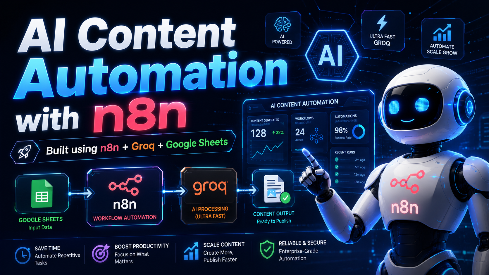
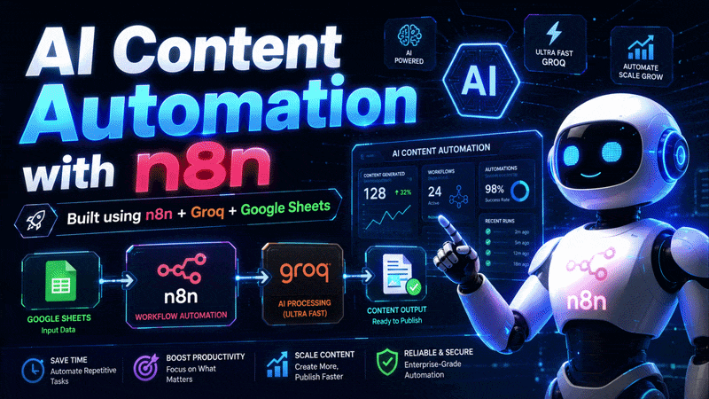
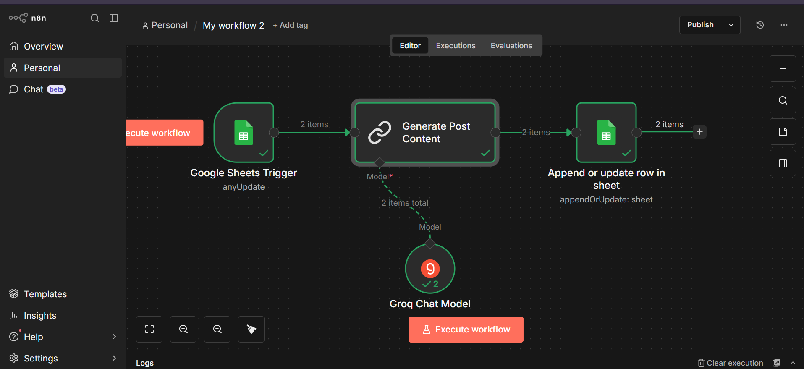

# 🚀 AI Content Automation using n8n + Groq

An AI-powered automation workflow that generates social media content automatically using **n8n**, **Groq AI**, and **Google Sheets**.

The system takes a topic from Google Sheets, generates platform-specific content using AI, and automatically stores the results back into Google Sheets.



---

## 🎥 Demo Video

Watch the full demo:

https://www.youtube.com/watch?v=sddVXJqOlKo

---

## ⚡ Live Workflow Preview



GitHub supports GIF previews in README files when linked correctly. :contentReference[oaicite:0]{index=0}

---

## 🔄 Workflow Architecture

```text
Google Sheets
      ↓
Google Sheets Trigger
      ↓
Groq AI
      ↓
Generate:
• Facebook Post
• LinkedIn Post
• Instagram Caption
      ↓
Google Sheets Update
      ↓
Store generated content automatically
```

---

## 📸 Screenshots

### Google Sheet Input


### n8n Workflow



### Generated Output


---

## ✨ Features

✅ AI-generated Facebook posts  
✅ AI-generated LinkedIn posts  
✅ AI-generated Instagram captions  
✅ Google Sheets integration  
✅ Automated workflow with n8n  
✅ Prompt engineering  
✅ No-code AI workflow  

---

## 🛠 Tech Stack

- n8n
- Groq API
- Google Sheets API
- Prompt Engineering
- AI Automation
- Generative AI

---

## 📂 Project Structure

```text
ai-content-automation-n8n/
│
├── assets/
│   ├── N8nAiAutomation.gif
│   └── thumbnail.png
│
├── prompts/
│   └── social_prompt.txt
│
├── screenshots/
│   ├── Google Sheet Input.png
│   ├── Google Sheet output.png
│   └── Workflow.png
│
├── Workflow.json
└── README.md
```

---

## 🚀 Future Improvements

- Direct Facebook posting
- LinkedIn auto-publishing
- Instagram scheduling
- Multiple language support
- AI analytics dashboard
- AI Agent integration

---

## 📌 Learning Outcomes

Through this project I learned:

- AI workflow automation
- API integration
- n8n workflow design
- Prompt engineering
- Google Sheets automation
- End-to-end AI systems

---

⭐ If you found this useful, consider starring the repository.
